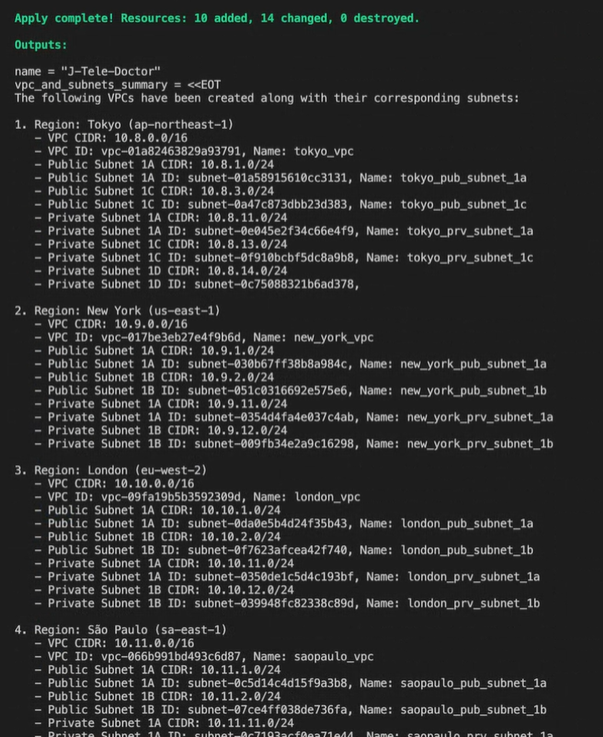
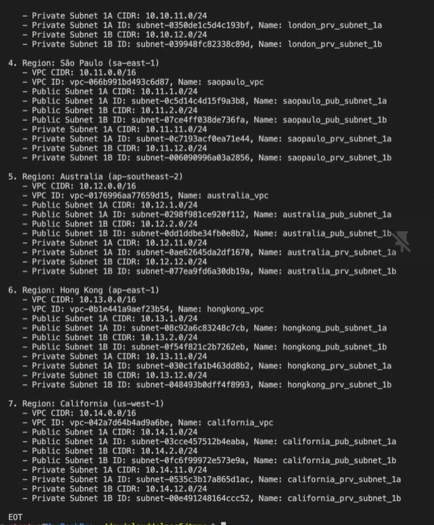
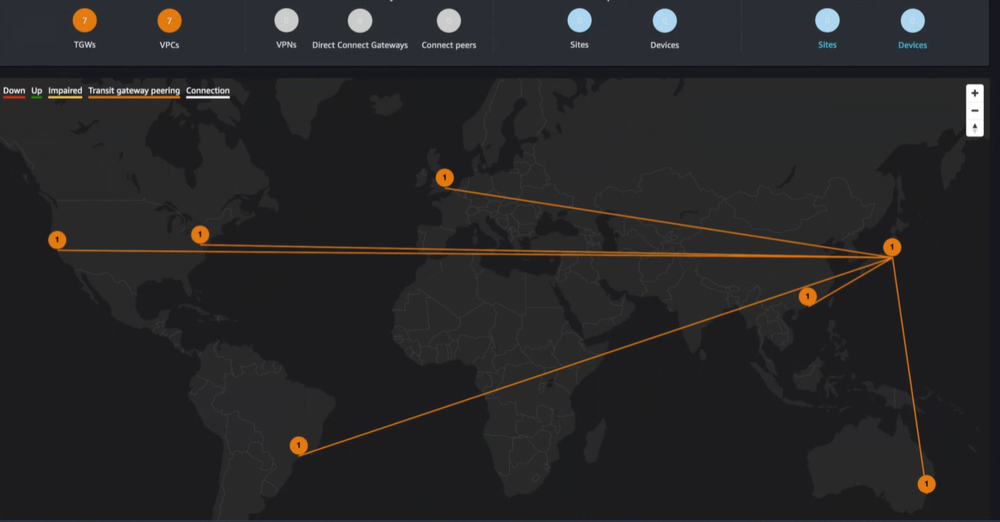
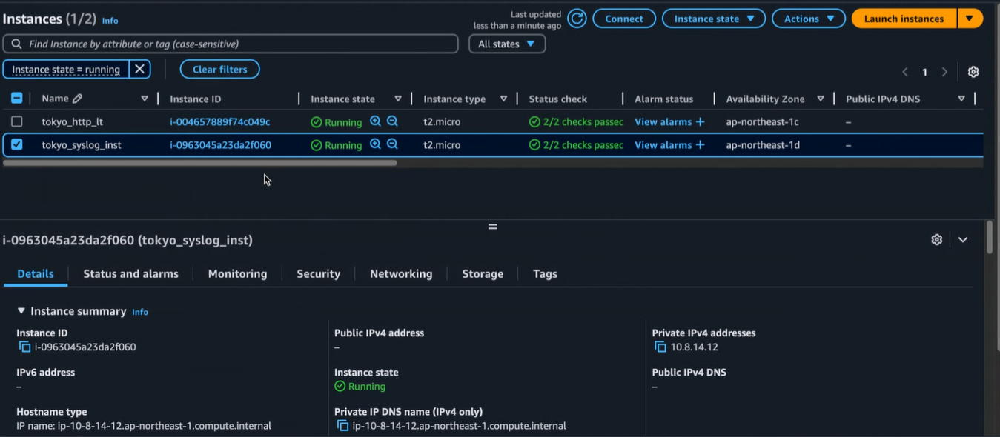

# Armageddon Project: TMMC Global Infrastructure

The **Armageddon Project** focuses on deploying a secure, scalable infrastructure for Tokyo Midtown Medical Center's **J-Tele-Doctor** service. The application will operate in **7 global regions**: Tokyo, New York, London, Sao Paulo, Australia, Hong Kong, and California, using **Auto Scaling Groups (ASGs)** with at least **2 Availability Zones (AZs)** per region. Each region will have **1 EC2 instance** allowing only **HTTP traffic (port 80)**. **Syslog data** will be securely transferred to Japan and stored exclusively in a **private subnet**, with strict compliance ensuring **no personal data** is stored or transferred outside Japan. This setup ensures global availability, data security, and future scalability.

## Requirements

### 1. **VPC Construction**
For each of the 7 regions, we will construct a dedicated **VPC (Virtual Private Cloud)**. The VPC provides network isolation for resources within each region. Each VPC will have a **CIDR block** that defines its IP address range. We will enable **DNS hostnames** within the VPC to ensure proper internal communication between resources.

The VPCs will be tagged for easy identification and management, and the instances deployed within these VPCs will be provisioned to operate within specific **Availability Zones (AZs)** to ensure fault tolerance and availability. This segmentation also supports future scalability and enhances security by isolating resources across regions.

### 2. **Subnet Construction**
Each VPC will be divided into multiple **subnets** to segregate resources based on their role and required access. For every region, we will create:

- **Public Subnets**: These will host internet-facing resources, such as EC2 instances, with access to the public internet.
- **Private Subnets**: These will be used for resources that do not need internet access, such as the storage of Syslog data and internal services.

Each subnet will be associated with specific **Availability Zones (AZs)** to enhance fault tolerance and ensure that services remain available even in the event of a failure in one AZ.

### 3. **Internet Access and NAT Gateways**
To enable instances in the private subnets to access the internet (for software updates, etc.), we will provision **NAT Gateways** in the public subnets. These NAT Gateways will be assigned Elastic IP addresses to allow for outbound internet traffic from private resources while maintaining their security by preventing inbound traffic.

Each region will have a dedicated **Internet Gateway** (IGW) attached to the public subnet for direct internet connectivity for public-facing resources, such as the EC2 instances.

### 4. **Routing Configuration**
Each subnet will have its own **Route Table** that defines the routing paths for traffic within the VPC. Public subnets will route traffic to the internet via the Internet Gateway, while private subnets will route traffic through the NAT Gateway for secure outbound internet access.

### 5. **Compliance and Data Security**
- **Syslog Data Security**: Syslog data will be securely transferred to Japan (Tokyo region) and stored in private subnets. No personal data will be transferred outside Japan, ensuring compliance with data privacy regulations.
- **Traffic Restrictions**: EC2 instances will only allow **HTTP traffic (port 80)** to ensure minimal exposure to the internet and secure application access.

This global infrastructure setup will ensure that the **J-Tele-Doctor** service is highly available, secure, and compliant with data protection standards, while providing the flexibility for future scalability.

## Infrastructure Overview

### Resources Assigned
Once the infrastructure is launched, the following resources and information will be displayed in the terminal:

## Infrastructure Overview

### Resources Assigned
Once the infrastructure is launched, the following resources and information will be available in the console:

1. **Transit Gateway - Global Connectivity**  
   The Transit Gateway will enable global connectivity between VPCs across different regions, ensuring secure and efficient communication. This centralized routing solution simplifies network management by providing a single point of connection for multiple VPCs. Visual representations of the Transit Gateway’s global map will be available in the console, showcasing how VPCs in different regions are interconnected.

2. **Syslog Infrastructure**  
   The Syslog infrastructure will ensure the secure collection and centralized storage of system logs. Logs will be stored in private subnets, enhancing security and ensuring that sensitive data is protected. Syslog data will be securely transferred to the Tokyo region, adhering to data residency and compliance requirements. Real-time monitoring and analysis tools, along with detailed visual representations of the syslog infrastructure, will also be available in the console for better management and oversight.
